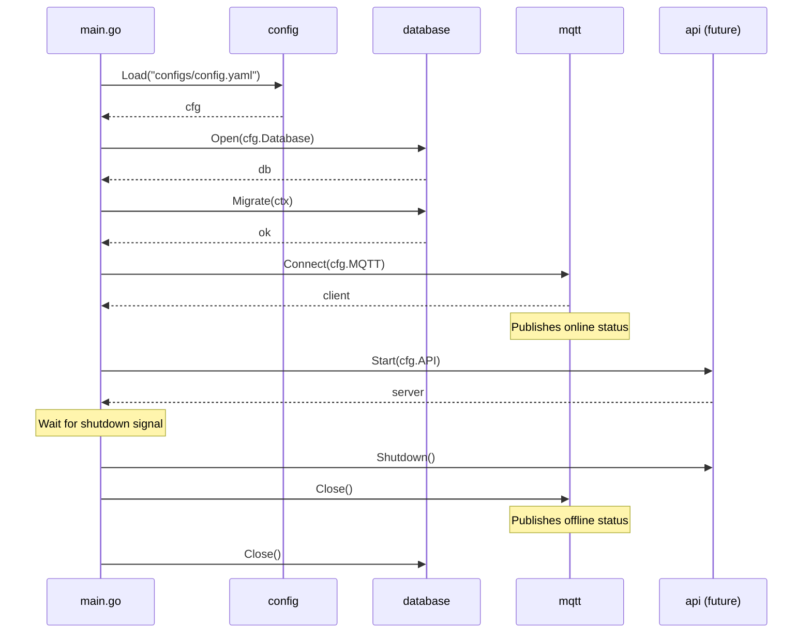
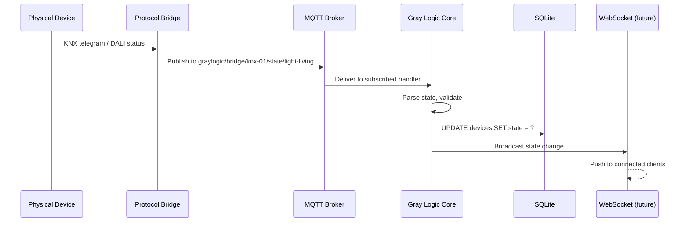
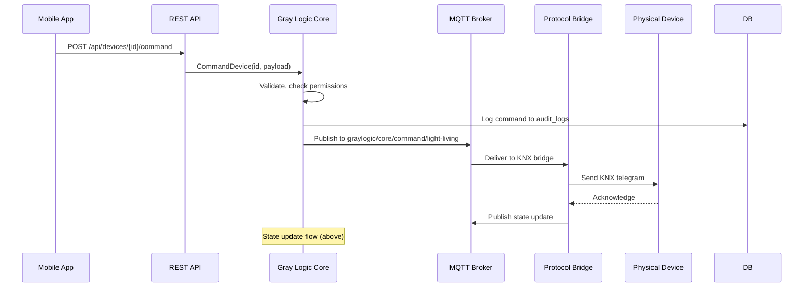

# Data Flow Architecture

> How data moves through Gray Logic Core

## Overview

Gray Logic Core acts as the central nervous system, orchestrating data flow between:
- **Configuration** → Loaded at startup
- **Database** → Persistent state and entity storage  
- **MQTT** → Real-time communication with protocol bridges
- **API** → User interface and external integrations (future)

---

## System Startup Flow



---

## Message Flow: Device State Update

When a physical device changes state (e.g., light turned on via wall switch):



---

## Message Flow: Command from UI

When a user toggles a light from the mobile app:



---

## Data Stores

### SQLite (Configuration & State)

| Table | Purpose | Example Data |
|-------|---------|--------------|
| `sites` | Site identity | ID, name, timezone |
| `areas` | Building areas | Floors, wings |
| `rooms` | Individual rooms | Kitchen, bedroom |
| `devices` | Device registry | Light, sensor, switch |
| `audit_logs` | Command history | Who, what, when |

### InfluxDB (Time-Series)

| Measurement | Purpose | Example Data |
|-------------|---------|--------------|
| `device_state` | Historical state | Temperature over time |
| `energy` | Power consumption | kWh per hour |
| `phm_metrics` | Predictive health | Relay cycles, lamp hours |

---

## Topic Namespace

All MQTT topics follow the `graylogic/` prefix:

```
graylogic/
├── system/
│   └── status              # Core online/offline status
├── bridge/
│   └── {bridge-id}/
│       ├── state/{device}  # Device state from bridge
│       └── command/{device} # Commands to bridge
└── core/
    ├── command/{device}    # Commands from Core
    └── event/{type}        # System events
```

See [docs/protocols/mqtt.md](file:///home/darren/Development/Projects/gray-logic-stack/docs/protocols/mqtt.md) for complete topic specification.

---

## Initialisation Order

Dependencies must be initialised in order:

```
1. Config       → No dependencies
2. Database     → Depends on config
3. MQTT         → Depends on config
4. Device Registry → Depends on database, MQTT
5. Automation   → Depends on device registry
6. API          → Depends on all above
```

**Shutdown is reverse order** to ensure graceful cleanup.

---

## Related Documents

- [error-handling.md](error-handling.md) — Error propagation patterns
- [packages/database.md](../packages/database.md) — Database architecture
- [packages/mqtt.md](../packages/mqtt.md) — MQTT architecture
