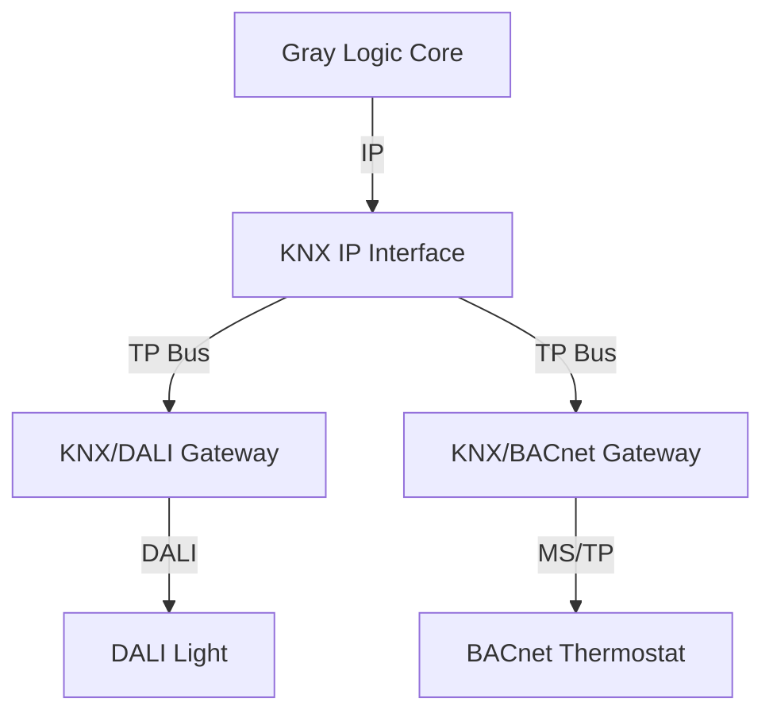

# Protocol Topology: Direct vs. KNX-Mediated

This document clarifies the architectural choices when integrating sub-protocols like DALI and BACnet.

## Scenario A: KNX as the "Backbone" (Residential Standard)
In this topology, KNX acts as the physical aggregator. Gray Logic sees everything as "KNX objects".



### PROS
- **Simplicity**: One pipe (KNX) for almost everything.
- **Reliability**: If Gray Logic dies, KNX switches still operate DALI lights directly via the gateway.
- **Wiring**: Electricians only need to worry about KNX cabling.

### CONS
- **"The Funnel Effect"**: KNX gateways act as filters. A DALI driver might report *Voltage*, *Current*, *Power*, *Temperature*, *Error Code*, and *Runtime*. A standard KNX gateway might only expose `Switch`, `Dim`, and `Fault`. You lose data.
- **Latency**: Commands must hop `Core -> KNX IP -> KNX TP -> Gateway -> DALI`.
- **Cost**: Good KNX/DALI gateways are expensive (~€300-500).

---

## Scenario C: Hybrid Dual-Homed (Commercial Standard)
*Based on your feedback: "Rely on KNX for control, act and observer on both."*

In this topology, the DALI bus is physically connected to **both** a KNX-DALI Gateway AND a Gray Logic DALI Bridge (or a single gateway that speaks both languages simultaneously).

```mermaid
graph TD
    GL[Gray Logic Core] -->|IP| KNX[KNX IP Interface]
    GL -->|IP/USB| DMon[Gray Logic DALI Monitor]
    KNX -->|TP| DGW[KNX/DALI Gateway]
    DGW -->|DALI| Light[DALI Light]
    DMon -.->|DALI (Listen Only)| Light
```

### PROS
- **Best of Both Worlds**: KNX guarantees the light turns on (reliability). Gray Logic sees the "Lamp Failure" error code that the KNX gateway dropped (observability).
- **Physical Fallback**: If Gray Logic is cut, the KNX wire still controls the lights.
- **Rich Data**: Gray Logic can query the DALI bus for advanced diagnostics without disturbing the KNX control flow (if done carefully).

### CONS (The "Collision" Reality)

It depends entirely on the hardware implementation:

1.  **Risk Scenerio: Parallel Hardware (Two Masters)**
    *   *Setup*: You connect a KNX Gateway AND a separate USB DALI Master to the same wires.
    *   *Result*: **YES, COLLISIONS**. DALI is slow (1200 baud). If both devices talk at once, data is corrupted. This is dangerous.

2.  **Safe Scenario: Dual-Interface Gateway (The "Traffic Cop")**
    *   *Concept*: This is NOT a "DALI Duplicator" (which is just a signal booster).
    *   *Hardware*: This requires a specific class of gateway that has **both** a KNX terminal AND an Ethernet port (serving an API like Modbus TCP or REST).
    *   *Example*: Use a **Tridonic DALI-GW** or similar industrial gateway.
    *   *How it works*: Use the KNX side for your wall switches. Use the Ethernet side for Gray Logic to read "Deep Data". The device's internal processor queues the commands safely.
    *   *Trade-off*: You cannot use a cheap/basic KNX-only gateway (like a standard MDT or ABB module) for this. You must buy pro hardware with an API.

3.  **Passive Monitoring Scenario ("The Spy") - REDUNDANT**
    *   *Result*: **You are exactly right.**
    *   *Why?*: Since "The Spy" only hears what the KNX Gateway asks for, it sees the exact same data that ends up on the KNX bus anyway.
    *   *Conclusion*: **Do not do this.** It adds hardware cost for zero new data. Just read the KNX Group Addresses via `knxd`.

---

## Hardware Costs & Realities (2026 Verified)

| Category | Typical Product | Cost | Technical Verification | Integration Effort |
| :--- | :--- | :--- | :--- | :--- |
| **Basic** | **MDT SCN-DALI64.03** | ~€450 | **LIMIT CONFIRMED.** Manual confirms mapped objects are "Lamp Fault" & "ECG Fault" only. **NO** voltage/current objects exist. | **Simple**<br>Program in ETS. Gray Logic reads status via knxd. |
| **Pro** | **LogicMachine 5**<br>(Power DALI) | ~€850 | **FULL ACCESS.** Supports raw `dalicmd` via Lua. Can query DALI-2 Part 253 diagnostics (Energy/Power) directly. | **Moderate**<br>Single hardware. Requires Lua script to expose data to MQTT. |
| **Industrial** | **Wago 750 Series**<br>(PLC + Modules) | ~€1,500+ | **FULL ACCESS.** DALI Module 753-647 supports DALI-2 diagnostics. | **Complex**<br>Requires Codesys PLC programming + ETS. Gray Logic talks Modbus TCP. |

### Final Recommendation: The "Scale" Pivot

**User Insight:** *"This is not just about a home... we can control massive spaces"*

This functionality requirement dictates the hardware choice:

1.  **For Residential / Small Commercial**:
    *   **Choice**: **Scenario A (MDT Basic)**.
    *   *Reason*: "Lamp Failure" is enough. Predictive voltage monitoring is overkill for 20 downlights.

2.  **For Massive Spaces / Industrial (Gray Logic Core Vision)**:
    *   **Choice**: **Scenario C (Hybrid/Pro Gateway)**.
    *   *Reason*: In a building with 5,000 lights, "Predictive Health Monitoring" (seeing voltage sags *before* failure) saves thousands in maintenance. **You CANNOT do this with the MDT gateway.**
    *   *Hardware*: **LogicMachine 5** is the sweet spot (~€850). It acts as the KNX Gateway (Standard) AND gives Gray Logic the raw data pipe.

1.  **DALI/BACnet are "Ad-Hoc Query" Protocols**:
    - You can ask a DALI driver: *"What is your manufacturing date?" "What is your internal voltage?" "What is your error history?"* anytime you want.
    - There are hundreds of possible data points per device.

2.  **KNX is a "Pre-Allocated Map" Protocol**:
    - In KNX (via ETS), you must pre-assign a specific **Group Address** (e.g., `1/0/5`) to a specific data point.
    - A KNX/DALI Gateway has a finite table of objects it exposes.
    - **Typical Limitation**: Most gateways expose "On/Off", "Dimming", "Scene", and "Lamp Failure".
    - **Missing Data**: Very few gateways expose "Internal Voltage", "Driver Temperature", or "Runtime Hours" because mapping 50 extra data points for 64 DALI drivers would require 3,200+ KNX Group Objects, which overwhelms the bus and the ETS project file.
    
**Conclusion**: The gateway hardware *could* read the data, but the KNX protocol bottleneck prevents it from efficiently exposing *all* of it. A parallel IP connection (Scenario B or C) bypasses this bottleneck.

---

## The Gray Logic "Device Layer" (The Complement)

Regardless of the topology chosen above, **Gray Logic's Device Layer abstracts this difference**.

The code says: `light.TurnOn()`.
- **Under Topology A**, it sends a Group Address write to `1/0/5`.
- **Under Topology B**, it sends a Modbus command to register `4005`.


### Configuration Workflow: LogicMachine 5 (The "Split Brain")

You asked: *"So I can utilize KNX to request data for this or setup in ETS?"*

**The Answer:** You use **BOTH**, but for different things.

1.  **ETS (The "Control" Path)**
    *   **What you do:** You load the LogicMachine application in ETS. You drag-and-drop "Light 1 On/Off" to `Group 1/0/1`.
    *   **Result:** Reliable, standard KNX control. "Switch -> Light" works instantly.
    *   **Limit:** You will **NOT** see "Voltage" or "Current" here. ETS doesn't have standard "Voltage" objects for every light.

2.  **Lua Scripting (The "Data" Path)**
    *   **What you do:** You write a small script in the LogicMachine web interface:
        ```lua
        -- Every 15 minutes, check voltage
        voltage = dalicmd("Query Actual Level", broadcast=false, address=5)
        mqtt.publish("graylogic/light/5/voltage", voltage)
        ```
    *   **Result:** This data goes **straight to IP (Gray Logic)** over MQTT.
    *   **Why?** You generally *don't* want to spam your slow KNX bus with thousands of voltage readings. We bypass KNX for the heavy data.

---

## Technical Appendix: How the "Bypass" Works

**User Question:** *"How?"* (does the script bypass the KNX bus?)

It works because the LogicMachine is not just a "Gateway" — it is a **Computer with two separate physical modems**.

```mermaid
graph TD
    subgraph LogicMachine Hardware
        CPU[Device CPU (Lua Scripts)]
        KNX_Chip[KNX TP Modem]
        DALI_Chip[DALI Master Chip]
        ETH[Ethernet Port]
    end

    %% Path 1: KNX Control
    Switch[Physical KNX Switch] -->|Twisted Pair| KNX_Chip
    KNX_Chip -->|Interrupt| CPU
    CPU -->|Path A: Control| DALI_Chip
    DALI_Chip -->|DALI Bus| Light[Light]

    %% Path 2: Data Bypass
    CPU -->|Path B: Script 15min| DALI_Chip
    DALI_Chip -->|Reply: 230V| CPU
    CPU -->|Path B: MQTT| ETH
    ETH -->|IP Network| GrayLogic[Gray Logic Core]
```

**The Critical Detail:**
*   **Path A (Control)**: Involves the `KNX_Chip`. Traffic flows `Switch -> KNX -> CPU -> DALI`.
*   **Path B (Data)**: The script running on the `CPU` talks *directly* to the `DALI_Chip`. The `KNX_Chip` **never sees** the voltage request or the reply. It remains silent and empty.

This is why you can pull megabytes of data via IP (Path B) without the KNX twisted pair (Path A) ever noticing.

---

## Physical Connection: The Wiring

**User Question:** *"Physically how do we connect Gray Logic to this device?"*

It is a standard **Ethernet** connection. They do not plug into each other directly; they plug into the same Network Switch.

```mermaid
graph TD
    subgraph Rack["Server Rack / Switch"]
        Switch[Ethernet Switch (PoE)]
    end

    subgraph Server["Gray Logic Server"]
        GL_Hardware[Intel NUC / Pi]
    end

    subgraph DinRail["Electrical Panel (DIN Rail)"]
        LM5[LogicMachine 5]
        KNX_PSU[KNX Power Supply]
        DALI_PSU[DALI Power Supply]
        Drivers[DALI Drivers]
    end

    %% Wiring
    GL_Hardware <==>|Cat6 Ethernet| Switch
    LM5 <==>|Cat6 Ethernet| Switch
    
    %% Field Bus
    LM5 -->|Twisted Pair (KNX)| KNX_PSU
    LM5 -->|Twisted Pair (DALI)| DALI_PSU
    DALI_PSU -->|2-Wire| Drivers
```

**Instructions:**
1.  **Mount** the LogicMachine 5 on the DIN rail in the electrical panel.
2.  **Wire** the KNX green cable and DALI purple cable to its terminals.
3.  **Plug** a standard Cat6 Ethernet cable into the LogicMachine's LAN port.
4.  **Connect** the other end to your main Network Switch.
5.  **Assign** a Static IP (e.g., `192.168.1.15`).
6.  Gray Logic (at `192.168.1.10`) now talks to it over the LAN.

---

## Software Logic: The Link

**User Question:** *"How do the Lua scripts connect to Ethernet... and how does Core connect to Lua?"*

**The Magic Word: MQTT.**

The LogicMachine is not just a DALI controller; it is a full Linux computer.

1.  **On the LogicMachine (The Sender)**:
    *   The Lua language inside has a **built-in library** called `require('mqtt')`.
    *   This library knows how to talk to the Ethernet hardware.
    *   You write: `mqtt.publish('192.168.1.10', 'current=0.5A')`.
    *   The Linux OS takes that text, wraps it in a TCP/IP packet, and blasts it out the Ethernet port.

2.  **On the Wire (The Transport)**:
    *   The data travels as standard TCP/IP traffic (Port 1883), identical to how your web browser creates traffic.

3.  **On Gray Logic (The Receiver)**:
    *   Gray Logic Core is running an **MQTT Broker** (Mosquitto) listening on Port 1883.
    *   It sees the incoming packet from the LogicMachine IP.
    *   It unpacks the text `current=0.5A` and saves it to the database.

**Summary:** The "Link" is just a standard network socket connection, exactly like a web page loading, but used for raw data.

---

## Control Strategy: The Hybrid Command

**User Question:** *"So can Gray Logic also control via this?"*

**Answer: YES.** The pipe is bidirectional. You can send `mqtt.publish("command", "Turn On")` -> Lua -> DALI Chip.

**HOWEVER**, we follow a strict **"Lane Discipline"** rule to avoid confusion:

| Function | Path to Use | Why? |
| :--- | :--- | :--- |
| **On / Off / Dim** | **KNX Path** (Standard) | Keeps physical wall switches in sync. If you turn it on via IP, the KNX wall switch might still think it's "Off" unless you do complex syncing. |
| **Color (RGBW)** | **IP Path** (Direct) | KNX Color control is often clunky (3 separate sliders). Direct DALI control via Lua is smooth and precise. |
| **Circadian Rhythm** | **IP Path** (Direct) | Changing color temp every minute via KNX floods the bus. Doing it via IP is silent and smooth. |
| **Emergency Test** | **IP Path** (Direct) | Triggering DALI emergency battery tests is much easier via script than KNX telegrams. |

**The Golden Rule:**
*   Use **KNX** for anything a human does with a switch (Basic Control).
*   Use **IP/Lua** for anything a machine does (Data, Color Algorithms, Maintenance).
