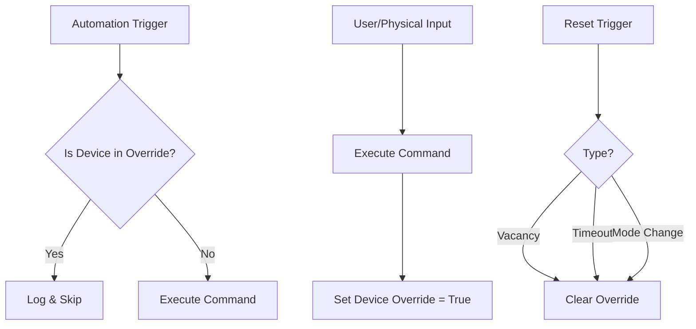

# Automation Override Logic

This document specifies the rules for resolving conflicts between automated actions (schedules, sensors) and user intent (manual control).

---

## The Problem

When a home "fights" the user, the user loses trust.
*   **Example:** A "Daylight Harvesting" rule dims lights to 50%. The user wants 100% and manually brightens them. 10 seconds later, the sensor rule runs again and dims them back to 50%.

## The Solution: Manual Override Latch

The system implements a **Manual Override Latch**. When a user manually controls a device (via UI, voice, or physical switch), that device enters an `override` state. While in this state, **lower-priority automations are blocked** from controlling that device.

---

## Override Mechanics

### 1. Triggering an Override

A device enters `override` state when:
1.  **Direct Command:** A `set_state` command is received with `source: user` (UI, Voice) or `source: physical` (Wall Switch).
2.  **Scene Activation:** A manual scene activation applies overrides to all affected devices.

### 2. Override Scope

The override applies to:
*   **The specific device:** The latch is tracked per-device (or per-group).
*   **The specific domain:** An override on "brightness" might not block "color temp" automation (configurable), but usually blocks the whole device for simplicity.

### 3. Resetting the Override (Reverting to Auto)

An override is cleared, returning the device to automation control, when:

#### A. Smart Reset (Vacancy - Preferred)
*   **Condition:** The room becomes vacant.
*   **Logic:** "If no motion detected in [Room] for [Timeout], clear all overrides in [Room]."
*   **Why:** If the user leaves the room, their manual preference is no longer relevant. The house should take over again to save energy.

#### B. Timeout (Fallback)
*   **Condition:** A fixed duration passes (e.g., 2 hours).
*   **Logic:** If the room has no occupancy sensors, use a safe fallback timer.

#### C. Manual Reset
*   **Condition:** User explicitly taps "Resume Auto" or "Eco Mode".
*   **Logic:** Clears the override flag immediately.

#### D. Mode Change
*   **Condition:** House mode changes (e.g., "Home" -> "Away" or "Home" -> "Night").
*   **Logic:** Major mode changes usually imply a context switch that invalidates previous manual overrides.

---

## Logic Flow



---

## Configuration

### Default Behavior

```yaml
automation:
  override:
    # Default fallback if no smart reset available
    default_timeout_minutes: 120
    
    # Smart reset configuration
    reset_on_vacancy: true
    vacancy_delay_minutes: 15      # Wait 15m after last motion before resetting
    
    # Context switches
    reset_on_mode_change: true     # "Night" mode clears day-time overrides
```

### Automation Priority Levels

Not all automations are equal. Safety must always override manual settings.

| Priority | Type | Can be Overridden? | Examples |
|----------|------|--------------------|----------|
| **1 (Critical)** | Safety | **No** | Fire Alarm (All lights ON), CO Detected (Vents Open) |
| **2 (High)** | Security | **No** | Alarm Armed (Lock doors), Panic Button |
| **3 (Manual)** | User | **Yes** | Wall switch, App control, Voice |
| **4 (Routine)** | Scene | **Yes** | "Cinema Mode", "Dinner Time" |
| **5 (Background)** | Sensor | **Yes** | Daylight harvesting, Temp maintenance, Circadian |

**Rule:** A higher priority command always executes and sets the latch. A lower priority command is ignored if the latch is set by a higher priority source.

---

## API & Data Model

### Device State Extension

The `DeviceState` object includes override information for UI visualization.

```json
{
  "device_id": "light-living-1",
  "state": {
    "on": true,
    "brightness": 100
  },
  "automation": {
    "status": "override",          // "auto" | "override"
    "source": "user",              // Who caused the override
    "since": "2026-01-17T10:00:00Z",
    "reset_condition": "vacancy_or_timeout",
    "blocked_intent": {            // What automation WANTS to do
       "brightness": 50,
       "reason": "daylight_harvesting"
    }
  }
}
```

### UI Representation

*   **Auto Mode:** Standard icon.
*   **Override Mode:** Small "Hand" icon or "Manual" badge.
*   **Interaction:** Tapping the "Hand" icon clears the override (resumes auto).

---

## Implementation Strategy

1.  **State Manager:** Update `SetState` to accept a `priority` and `source`.
2.  **Latch Logic:** In `SetState`, if `new_priority < current_latch_priority`, reject command.
3.  **Reset Logic:** The `Room` entity monitors occupancy. When `occupancy=false` for `N` minutes, it sends a `ClearOverride` signal to all devices in that room.
