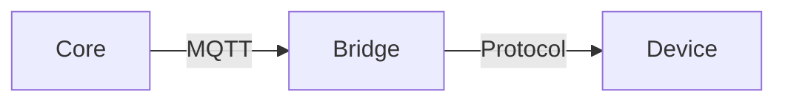

# Documentation Guide

This document defines standards for Gray Logic documentation — structure, frontmatter, and conventions.

---

## YAML Frontmatter

Every documentation file MUST include YAML frontmatter with these fields:

### Required Fields

```yaml
---
title: "Human-Readable Title"
version: 1.0.0
status: active
last_updated: 2026-01-17
---
```

### Recommended Fields

```yaml
---
title: "Document Title"
version: 1.0.0
status: active                      # active | draft | deprecated
implementation_status: specified    # See below
last_updated: 2026-01-17
depends_on:                         # Related documents
  - architecture/system-overview.md
  - data-model/entities.md
roadmap: Year 2                     # If not for immediate implementation
---
```

---

## Implementation Status

The `implementation_status` field tracks whether a specification has been implemented in code. This is critical for a project in pre-implementation phase.

### Status Values

| Status | Meaning |
|--------|---------|
| **draft** | Initial ideas, not ready for implementation |
| **specified** | Complete specification, ready to implement |
| **implemented** | Code exists that implements this spec |
| **validated** | Implementation tested against spec, confirmed working |
| **n/a** | Document doesn't describe implementable features (guides, principles) |

### Usage

```yaml
# Before any code is written
implementation_status: specified

# Once code exists
implementation_status: implemented

# After integration testing confirms it works
implementation_status: validated
```

### Current State

As of 2026-01-17, all Gray Logic specifications are in `specified` status. No code implementation exists yet. When implementation begins:

1. Update `implementation_status` as code is written
2. Note any deviations from specification
3. Update specification if implementation reveals issues

---

## Document Status

The `status` field indicates the document's lifecycle:

| Status | Meaning |
|--------|---------|
| **draft** | Work in progress, subject to major changes |
| **active** | Current specification, stable |
| **deprecated** | Superseded by another document |
| **archived** | Historical reference only |

---

## Versioning

Documents use semantic versioning:

- **Major (1.x.x → 2.x.x)**: Breaking changes to specification
- **Minor (1.0.x → 1.1.x)**: New features, additions
- **Patch (1.0.0 → 1.0.1)**: Clarifications, typo fixes

---

## File Organisation

```
docs/
├── overview/              # Vision, principles, glossary (start here)
├── architecture/          # System design, core internals
│   └── decisions/         # Architecture Decision Records (ADRs)
├── data-model/            # Entity definitions, schemas
│   └── schemas/           # JSON Schema files
├── domains/               # Per-domain specifications (lighting, climate, etc.)
├── automation/            # Scenes, schedules, modes, events
├── intelligence/          # Voice, PHM, AI features
├── resilience/            # Offline operation, backup, disaster recovery
├── protocols/             # Protocol bridge specifications
├── interfaces/            # API specs, UI specifications
├── operations/            # Monitoring, maintenance, updates
├── deployment/            # Installation guides
├── commissioning/         # Setup and configuration
├── integration/           # External system integration
├── business/              # Business case, pricing, certification
├── development/           # Coding standards, testing, this guide
└── archive/               # Previous documentation versions
```

---

## Cross-References

### Linking Documents

Use relative paths:

```markdown
See [System Overview](../architecture/system-overview.md) for architecture details.
```

### Linking Sections

Use anchors:

```markdown
See [Authentication Methods](../architecture/security-model.md#authentication-methods)
```

### depends_on

List documents that must be read first:

```yaml
depends_on:
  - overview/principles.md
  - architecture/system-overview.md
```

---

## Writing Style

### Terminology

- Use terms from [Glossary](../overview/glossary.md)
- Define new terms before using them
- Be consistent (don't mix "device" and "entity")

### Technical Writing

- **Active voice**: "Core validates the request" not "The request is validated"
- **Present tense**: "The system sends a message" not "The system will send"
- **Specific**: "Returns within 100ms" not "Returns quickly"
- **No marketing language**: Technical facts only

### RFC 2119

Use RFC 2119 keywords for requirements:

- **MUST** / **MUST NOT**: Absolute requirement
- **SHOULD** / **SHOULD NOT**: Strong recommendation
- **MAY**: Optional

```markdown
Bridges MUST publish a health message every 30 seconds.
Commands SHOULD complete within 500ms.
Bridges MAY implement COV subscriptions.
```

---

## Diagrams

### ASCII Art

For simple diagrams in markdown:

```
┌─────────────┐     MQTT      ┌─────────────┐
│    Core     │ ◄──────────►  │   Bridge    │
└─────────────┘               └─────────────┘
```

### Mermaid (Recommended)

For complex diagrams, use Mermaid syntax:



---

## Examples

### Good Example

```yaml
---
title: KNX Protocol Specification
version: 1.0.0
status: active
implementation_status: specified
last_updated: 2026-01-17
depends_on:
  - architecture/bridge-interface.md
  - data-model/entities.md
---

# KNX Protocol Specification

This document specifies how Gray Logic integrates with KNX building automation systems.

## Overview

The KNX Bridge connects Gray Logic Core to KNX/IP interfaces...
```

### Code Blocks

Always specify language:

```go
func (b *Bridge) Start() error {
    // Implementation
}
```

### Configuration Examples

Use YAML for configuration examples:

```yaml
knx:
  interface:
    type: "ip"
    host: "192.168.1.50"
    port: 3671
```

---

## Updating Documents

When updating specifications:

1. Update `last_updated` date
2. Increment version if significant change
3. Update any related documents
4. Update ADR if architectural decision changed

---

## AI Assistant Notes

Documentation is designed to be machine-readable:

- YAML frontmatter enables parsing
- Consistent structure aids comprehension
- Cross-references enable navigation
- JSON schemas provide formal contracts

When AI assistants work with this documentation:

1. Read `overview/principles.md` first
2. Use `overview/glossary.md` for terminology
3. Follow `depends_on` chains for context
4. Check `implementation_status` before assuming code exists
